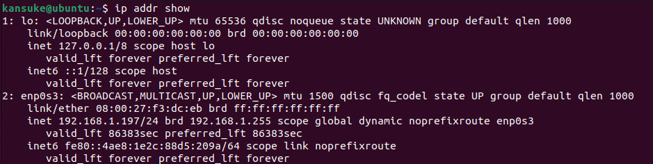

# Cài đặt `nginx` trên máy ảo ubuntu 

Bước 1: Cài đặt máy ảo

- Virtualbox
- VM
- QEMU
Cài 1 trong 3 cái nào cũng được

Bước 2: Cài đặt và cấu hình nginx-server

- Thao tác lệnh lần lượt từ trên xuống dưới

```
$ sudo apt update

```

```
$ sudo apt install nginx

```

Nếu được hỏi thì ấn `y` và ENTER để tiếp tục cài đặt

Nếu bạn đã bật tường lửa `ufw` thì bạn cần cho phép kết nối đến nginx
Để kiểm tra xem `ufw` có khả dụng không hãy chạy:

```
$ sudo ufw app list

```

```
Output
Available applications:
  Nginx Full
  Nginx HTTP
  Nginx HTTPS
  OpenSSH

```

Nếu chưa có OpenSSH trong list hãy chạy lệnh: `sudo apt install openssh-server`

Cho phép lưu lượng HTTP thông thường trên cổng 80:

```
$ sudo ufw allow 'Nginx HTTP'

```

Kiểm tra sự thay đổi bằng cách:

```
$ sudo ufw status

```

```
Output
Status: active

To                         Action      From
--                         ------      ----
OpenSSH                    ALLOW       Anywhere
Nginx HTTP                 ALLOW       Anywhere
OpenSSH (v6)               ALLOW       Anywhere (v6)
Nginx HTTP (v6)            ALLOW       Anywhere (v6)

```

Kiểm tra tên miền trỏ đến máy và IP công khai

```
$ ip addr show

```

```
$ hostname -I

```

Hoặc xem IP nào có thể truy cập được khi xem từ các vị trí khác trên internet

```
$ curl -4 icanhazip.com

```

 


Check xem đã cài đặt thành công nginx chưa

```
http://192.168.1.197

```


