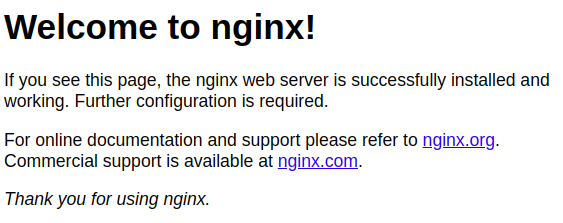
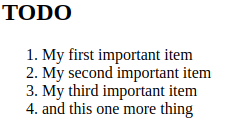

# Cài đặt `nginx` trên máy ảo ubuntu 

Bước 1: Cài đặt máy ảo

- Virtualbox
- VM
- QEMU
Cài 1 trong 3 cái nào cũng được

Bước 2: Cài đặt và cấu hình nginx-server

- Thao tác lệnh lần lượt từ trên xuống dưới

```
$ sudo apt update

```

```
$ sudo apt install nginx

```

Nếu được hỏi thì ấn `y` và `ENTER` để tiếp tục cài đặt

Nếu bạn đã bật tường lửa `ufw` thì bạn cần cho phép kết nối đến nginx
Để kiểm tra xem `ufw` có khả dụng không hãy chạy:

```
$ sudo ufw app list

```

```
Output
Available applications:
  Nginx Full
  Nginx HTTP
  Nginx HTTPS
  OpenSSH

```

Nếu chưa có OpenSSH trong list hãy chạy lệnh: `sudo apt install openssh-server`

Cho phép lưu lượng HTTP thông thường trên cổng 80:

```
$ sudo ufw allow 'Nginx HTTP'

```

Kiểm tra sự thay đổi bằng cách:

```
$ sudo ufw status

```

```
Output
Status: active

To                         Action      From
--                         ------      ----
OpenSSH                    ALLOW       Anywhere
Nginx HTTP                 ALLOW       Anywhere
OpenSSH (v6)               ALLOW       Anywhere (v6)
Nginx HTTP (v6)            ALLOW       Anywhere (v6)

```

Kiểm tra tên miền trỏ đến máy và IP công khai

```
$ ip addr show

```

```
$ hostname -I

```

Hoặc xem IP nào có thể truy cập được khi xem từ các vị trí khác trên internet

```
$ curl -4 icanhazip.com

```

 


Check xem đã cài đặt thành công nginx chưa

```
http://192.168.1.197

```

Nếu ra như này thì là thành công rồi




Bước 3: Cài đặt MySQL

```
$ sudo apt install mysql-server

```
Khi được nhắc hãy bấm `y` và `ENTER`

```
$ sudo mysql_secure_installation

```

Bạn sẽ nhận được câu hỏi xem có muốn cấu hình `VALIDATE PASSWORD PLUGIN`

Bấm y|yes để tiếp tục mà không cần kích hoạt

```
Output
VALIDATE PASSWORD COMPONENT can be used to test passwords
and improve security. It checks the strength of password
and allows the users to set only those passwords which are
secure enough. Would you like to setup VALIDATE PASSWORD component?

Press y|Y for Yes, any other key for No:

```

Nếu bạn chọn y thì bạn sẽ được yêu cầu chọn mức độ xác thực mật khẩu

```
Output
There are three levels of password validation policy:

LOW    Length >= 8
MEDIUM Length >= 8, numeric, mixed case, and special characters
STRONG Length >= 8, numeric, mixed case, special characters and dictionary              file

Please enter 0 = LOW, 1 = MEDIUM and 2 = STRONG: 1

```

Nếu bạn đã bật xác thực mật khẩu, bạn sẽ thấy độ mạnh của mật khẩu gốc đã nhập và máy chủ sẽ hỏi bạn có muốn tiếp tục sử dụng mật khẩu đó hay không 
Nếu bạn hài lòng với mật khẩu hiện tại, hãy nhấn Y"có" tại dấu nhắc

```
Output
Estimated strength of the password: 100 
Do you wish to continue with the password provided?(Press y|Y for Yes, any other key for No) : y

```

Đối với các câu còn lại hãy bấm `y` và `ENTER` tại dấu nhắc

Khi hoàn tất hãy kiểm tra bằng lệnh:

```
$ sudo mysql

```

Nếu thành công sẽ nhận được:

```
Output
Welcome to the MySQL monitor.  Commands end with ; or \g.
Your MySQL connection id is 10
Server version: 8.0.28-0ubuntu4 (Ubuntu)

Copyright (c) 2000, 2022, Oracle and/or its affiliates.

Oracle is a registered trademark of Oracle Corporation and/or its
affiliates. Other names may be trademarks of their respective
owners.

Type 'help;' or '\h' for help. Type '\c' to clear the current input statement.

mysql>

```

Thoát khỏi MySQL bằng lệnh:

```
mysql> exit

```

Bước 4: Cài đặt PHP

```
$ sudo apt install php8.1-fpm php-mysql

```

Khi được nhắc hãy ấn `y` và `ENTER`

Bước 5: Cấu hình Nginx để sử dụng bộ xử lí PHP

Ví dụ cho domain là: kansuke

```
$ sudo mkdir /var/www/kansuke

```

Tiếp theo, gán quyền sở hữu thư mục $USERbằng biến môi trường, biến này sẽ tham chiếu đến người dùng hệ thống hiện tại của bạn

```
sudo chown -R $USER:$USER /var/www/kansuke

```

Sau đó mở thư mục sites-available và tạo 1 tệp cấu hình mới

```
$ sudo nvim /etc/nginx/sites-available/kansuke

```

Dán đoạn code sau vào file đó:

```
server {
    listen 80;
    server_name kansuke www.kansuke;
    root /var/www/kansuke;

    index index.html index.htm index.php;

    location / {
        try_files $uri $uri/ =404;
    }

    location ~ \.php$ {
        include snippets/fastcgi-php.conf;
        fastcgi_pass unix:/var/run/php/php8.1-fpm.sock;
     }

    location ~ /\.ht {
        deny all;
    }

}

```

Sau đây là chức năng của từng chỉ thị và khối vị trí này:

- listen— Xác định cổng mà Nginx sẽ lắng nghe. Trong trường hợp này, nó sẽ lắng nghe trên cổng 80, cổng mặc định cho HTTP.

- root— Xác định gốc tài liệu nơi lưu trữ các tập tin được cung cấp bởi trang web này.

- index— Xác định thứ tự Nginx sẽ ưu tiên các tệp chỉ mục cho trang web này. Việc liệt kê index.htmlcác tệp có mức độ ưu tiên cao hơn index.phpcác tệp khác là một thông lệ phổ biến để nhanh chóng thiết lập trang đích bảo trì trong các ứng dụng PHP. Bạn có thể điều chỉnh các cài đặt này để phù hợp hơn với nhu cầu ứng dụng của mình.

- server_name— Xác định tên miền và/hoặc địa chỉ IP mà khối máy chủ này sẽ phản hồi. Trỏ chỉ thị này đến tên miền hoặc địa chỉ IP công khai của máy chủ của bạn.

- location /— Khối vị trí đầu tiên bao gồm một try_fileschỉ thị, kiểm tra sự tồn tại của các tệp hoặc thư mục khớp với yêu cầu URL. Nếu Nginx không tìm thấy tài nguyên phù hợp, nó sẽ trả về lỗi 404.

- location ~ \.php$— Khối vị trí này xử lý quá trình PHP thực tế bằng cách trỏ Nginx đến fastcgi-php.conftệp cấu hình và php8.1-fpm.socktệp khai báo ổ cắm nào được liên kết với php8.1-fpm.

- location ~ /\.ht— Khối vị trí cuối cùng xử lý .htaccesscác tệp mà Nginx không xử lý. Bằng cách thêm deny allchỉ thị này, nếu bất kỳ .htaccesstệp nào vô tình lọt vào thư mục gốc của tài liệu, chúng sẽ không được phục vụ cho khách truy cập.


Kích hoạt cấu hình bằng cách liên kết đến tệp cấu hình từ thư mục Nginx `sites-enabled`:

```
$ sudo ln -s /etc/nginx/sites-available/your_domain /etc/nginx/sites-enabled/

```

Sau đó hủy liên kết cấu hình mặc định trong thư mục /sites-enabled/

```
$ sudo unlink /etc/nginx/sites-enabled/default

```

Lưu ý : Nếu bạn cần khôi phục cấu hình mặc định, bạn có thể thực hiện bằng cách tạo lại liên kết tượng trưng, như sau:

```
$ sudo ln -s /etc/nginx/sites-available/default /etc/nginx/sites-enabled/

```

Check lỗi cấu hình nginx bằng lệnh:

```
$ sudo nginx -t 

```

Nếu thấy bất kì log nào thì hãy quay lại file cấu hình nginx kiểm tra

Sau đó nếu không lỗi hay tải lại nginx bằng lệnh:

```
$ sudo systemctl reload nginx

```

Khi này hãy tạo 1 file html để xem máy chủ có hoạt động tốt không:

```
$ nvim /var/www/kansuke/index.html

```

Với nội dung:

```
<html>
  <head>
    <title>kansuke website</title>
  </head>
  <body>
    <h1>Hello World!</h1>

    <p>This is the landing page of <strong>kansuke</strong>.</p>
  </body>
</html>

```

Khi này hãy truy cập bằng trình duyệt:

```
http://192.168.1.197

```

Nếu ra kết quả như sau khi thành công

```
Hello World!
This is the landing page of kansuke.

```

Bước 6: Kiểm tra PHP với Nginx

```
$ nvim /var/www/kansuke/info.php

```

```/var/www/tên_miền_của_bạn/info.php

<?php
phpinfo();

```

Sau đó truy cập trình duyệt và nhập: `http://192.168.1.197`

Kết quả trả về sẽ là 1 bảng chi tiết về máy chủ của bạn

Bước 7: Kiểm tra kết nối CSDL từ PHP (tùy chọn)

```
$ sudo mysql

```

```
$ CREATE DATABASE example_database;

```

```
$ CREATE USER 'example_user'@'%' IDENTIFIED WITH mysql_native_password BY 'password';

```
Bây giờ chúng ta cần cấp cho người dùng này quyền truy cập vào example_databasecơ sở dữ liệu:

```
$ GRANT ALL ON example_database.* TO 'example_user'@'%';

```

Điều này sẽ cấp cho người dùng example_user toàn quyền đối với cơ sở dữ liệu example_database đồng thời ngăn người dùng này tạo hoặc sửa đổi các cơ sở dữ liệu khác trên máy chủ của bạn.

Bây giờ hãy thoát khỏi mysql:

```
mysql> exit

```

Sau đó vào với quyền user

```
$ mysql -u example_user -p

```

Sau khi đăng nhập vào bảng điều khiển MySQL, hãy xác nhận rằng bạn có quyền truy cập vào cơ sở dữ liệu example_database :

```
mysql> SHOW DATABASES;

```

Kết quả là:

```
Output
+--------------------+
| Database           |
+--------------------+
| example_database   |
| information_schema |
+--------------------+
2 rows in set (0.000 sec)

```

Tiếp theo, chúng ta sẽ tạo một bảng thử nghiệm có tên là todo_list . Từ bảng điều khiển MySQL, hãy chạy câu lệnh sau:

```
mysql> CREATE TABLE example_database.todo_list (
mysql>      item_id INT AUTO_INCREMENT,
mysql>	    content VARCHAR(255),
mysql>  	PRIMARY KEY(item_id)
mysql>  );

```

Chèn nội dung:

```
mysql> INSERT INTO example_database.todo_list (content) VALUES ("My first important item");

```

Xác nhận đã lưu dữ liệu vào bảng bằng lệnh:

```
mysql> SELECT * FROM example_database.todo_list;

```

Kết quả là:

```
Output
+---------+--------------------------+
| item_id | content                  |
+---------+--------------------------+
|       1 | My first important item  |
|       2 | My second important item |
|       3 | My third important item  |
|       4 | and this one more thing  |
+---------+--------------------------+
4 rows in set (0.000 sec)

```

Sau đó thoát bằng: `mysql> exit`

Tiếp theo là tạo 1 tệp php để kết nối và lấy kết quả của database

```
$ nvim /var/www/kansuke/todo_list.php

```

Nội dung file `todo_list.php`:

```
<?php
$user = "example_user";
$password = "password";
$database = "example_database";
$table = "todo_list";

try {
  $db = new PDO("mysql:host=localhost;dbname=$database", $user, $password);
  echo "<h2>TODO</h2><ol>"; 
  foreach($db->query("SELECT content FROM $table") as $row) {
    echo "<li>" . $row['content'] . "</li>";
  }
  echo "</ol>";
} catch (PDOException $e) {
    print "Error!: " . $e->getMessage() . "<br/>";
    die();
}

```

Sau đó truy cập từ web bằng cách: `http://192.168.1.197/todo_list.php`

Kết quả là:



Yehhh vậy là xong rồi đó, nhưng đây chỉ là thứ cơ bản nhất thôi. Nếu thấy hay hãy cho tui xin 1 follow và 1 sao vào repo này nhé

[Github](https://github.com/kansuke20xx/nginx-lab?tab=readme-ov-file) 
